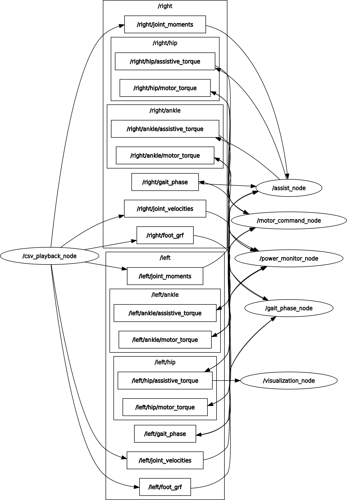
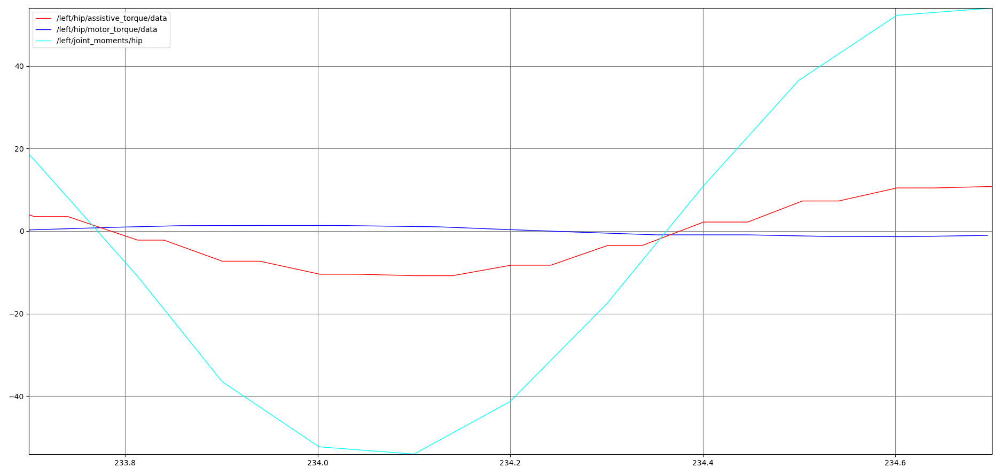
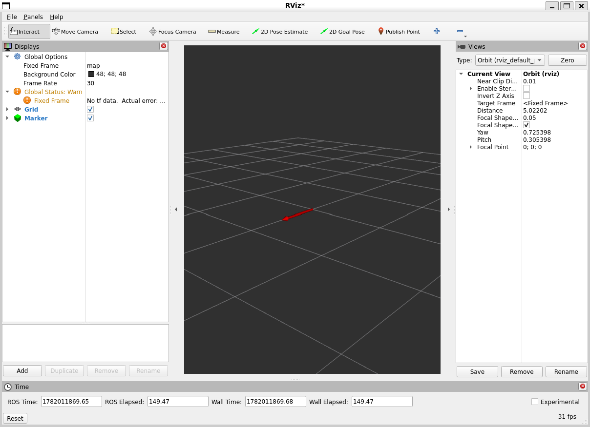

# ROS2 Modular Lower-Limb Exoskeleton Control & Analysis Framework

> A modular ROS2 software framework demonstrating the complete control and analysis pipeline for a bilateral lower-limb exoskeleton.

This project implements a modular ROS2 framework for simulating and analyzing bilateral lower-limb exoskeleton control using synthetic gait data. The framework processes joint kinematics, joint kinetics, and ground reaction forces to estimate gait phase, compute assistive torques, generate motor commands, estimate power consumption, and visualize system behavior using standard ROS2 tools.

---

## Table of Contents

- [Overview](#overview)
- [System Architecture](#system-architecture)
- [Software Pipeline](#software-pipeline)
- [Features](#features)
- [Background](#background)
- [Project Structure](#project-structure)
- [ROS Topics](#ros-topics)
- [Custom Messages](#custom-messages)
- [Installation](#installation)
- [Running the Project](#running-the-project)
- [Visualization](#visualization)
- [Sample Data](#sample-data)
- [Future Improvements](#future-improvements)
- [License](#license)

---

# Overview

This project implements a modular ROS2 pipeline for simulating the control architecture of a bilateral lower-limb exoskeleton. Rather than combining all functionality into a single node, the system is divided into independent ROS2 nodes that communicate through ROS topics, making the framework easy to understand, extend, and debug.

The framework reproduces a typical exoskeleton software pipeline:

- Playback of synthetic biomechanical gait data
- Ground reaction force (GRF) based gait phase detection
- Assistive torque computation
- Motor torque conversion using drivetrain gear ratios
- Mechanical and electrical power estimation
- Battery current and runtime estimation
- Real-time visualization using RViz2 and ROS visualization tools

Although the current implementation uses synthetic gait data for demonstration purposes, the modular architecture allows the CSV playback node to be replaced with live sensors in future hardware implementations.

---

# System Architecture

The framework follows a modular publish-subscribe architecture in ROS2. Each node performs a single responsibility and communicates with other nodes through ROS topics.

```text
                CSV Playback Node
                       │
      ┌────────────────┼────────────────┐
      │                │                │
      ▼                ▼                ▼
 Joint Angles    Joint Moments   Joint Velocities
                       │
                       ▼
                Ground Reaction Force
                       │
                       ▼
               Gait Phase Detection
                       │
                       ▼
             Assistive Torque Controller
                       │
                       ▼
             Motor Command Conversion
                       │
                       ▼
        Power & Battery Monitoring
                       │
                       ▼
             RViz2 Visualization
```

Each node follows the **single-responsibility principle**, allowing individual components to be developed, tested, and replaced independently.

---

# Software Pipeline

The current implementation processes data through the following sequence:

1. CSV Playback
2. Joint Angle, Joint Moment, Joint Velocity and GRF publication
3. Gait Phase Detection
4. Assistive Torque Computation
5. Motor Torque Conversion
6. Mechanical & Electrical Power Estimation
7. Battery Current & Runtime Estimation
8. RViz2 Visualization

---

# Features

## Control

- Bilateral lower-limb processing
- Ground reaction force based gait phase detection
- Hip assistive torque computation
- Stance-phase ankle assistive torque computation
- Configurable motor gear ratios
- Motor torque saturation limits

## Analysis

- Mechanical power estimation
- Electrical power estimation
- Battery current estimation
- Runtime estimation

## Software

- Modular ROS2 node-based architecture
- Custom ROS2 message definitions
- Launch file support
- ROS2 parameter-based configuration
- RViz2 visualization
- rqt_graph compatibility
- rqt_plot compatibility
- Synthetic gait dataset generation

---

# Background

This framework was developed as an extension of my M.S. Robotics capstone project at the Georgia Institute of Technology.

The original capstone focused on the feasibility study and design of an integrated bilateral hip–ankle exoskeleton. This ROS2 framework translates that work into a modular software architecture for control, analysis, and visualization while following the software design principles commonly used in robotic systems.

---

# Project Structure

```text
ros2-exoskeleton-control-framework/
│
├── sample_data/
│   ├── sample_walk.csv
│
├── scripts/
│   └── generate_sample_data.py
│
├── images/
│   ├── rqt_graph.png
│   ├── rqt_plot.png
│   └── rviz_marker.png
│
├── src/
│   ├── exo_control/
│   └── exo_interfaces/
│
├── README.md
└── .gitignore
```

---

# ROS Topics

| Topic | Description |
|--------|-------------|
| `/left/joint_angles` | Left leg joint angles |
| `/right/joint_angles` | Right leg joint angles |
| `/left/joint_moments` | Left leg joint moments |
| `/right/joint_moments` | Right leg joint moments |
| `/left/joint_velocities` | Left leg joint velocities |
| `/right/joint_velocities` | Right leg joint velocities |
| `/left/foot_grf` | Left ground reaction force |
| `/right/foot_grf` | Right ground reaction force |
| `/left/gait_phase` | Left gait phase |
| `/right/gait_phase` | Right gait phase |
| `/left/hip/assistive_torque` | Left hip assistive torque |
| `/right/hip/assistive_torque` | Right hip assistive torque |
| `/left/ankle/assistive_torque` | Left ankle assistive torque |
| `/right/ankle/assistive_torque` | Right ankle assistive torque |
| `/left/hip/motor_torque` | Left hip motor torque |
| `/right/hip/motor_torque` | Right hip motor torque |
| `/left/ankle/motor_torque` | Left ankle motor torque |
| `/right/ankle/motor_torque` | Right ankle motor torque |

---

# Custom Messages

The `exo_interfaces` package defines three custom ROS2 messages.

### JointAngles.msg

```text
float32 hip
float32 knee
float32 ankle
```

### JointMoments.msg

```text
float32 hip
float32 knee
float32 ankle
```

### JointVelocities.msg

```text
float32 hip
float32 knee
float32 ankle
```

---

# Installation

Clone the repository:

```bash
git clone https://github.com/Krishna-010/ros2-exoskeleton-control-framework.git

cd ros2-exoskeleton-control-framework
```

Build the workspace:

```bash
colcon build

source install/setup.bash
```

---

# Running the Project

Launch the complete framework:

```bash
ros2 launch exo_control exo_demo.launch.py
```

The launch file starts the following nodes:

- CSV Playback Node
- Gait Phase Node
- Assist Node
- Motor Command Node
- Power Monitor Node
- Visualization Node

---

# Visualization

## ROS Graph

The figure below illustrates the modular ROS2 node and topic architecture.



---

## Live Topic Plot

The following plot demonstrates the relationship between joint moment, assistive torque, and motor torque.



---

## RViz2 Visualization

Assistive torque is visualized in RViz2 using ROS visualization markers.



---

# Sample Data

The repository contains a synthetic gait dataset (`sample_data/sample_walk.csv`) generated specifically for demonstration purposes.

The synthetic data reproduces the structure expected by the framework while avoiding the use of proprietary laboratory or participant data.

---

# Future Improvements

Potential future extensions include:

- Live IMU and force sensor integration
- Hardware interface using ROS2 Control
- URDF-based exoskeleton visualization
- Real-time human subject experiments
- Alternative assistive controllers
- Battery state-of-charge estimation
- Hardware-in-the-loop testing

---

# License

This project is released under the MIT License.